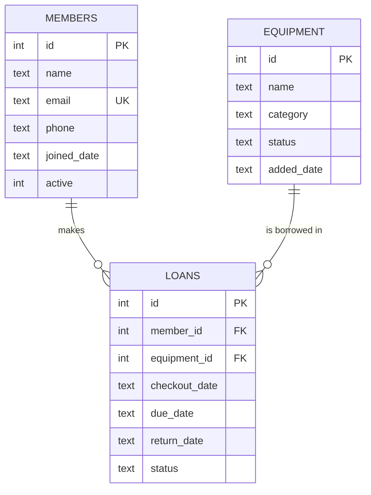

# Design Notes — Campus MakerSpace Checkout System

This document explains how the project is organised and why. It's also
my cheat-sheet for the live demo.

---

## 1. How the layers fit together

```
main.py              — main menu, dispatches to menus/
menus/               — one file per menu, reads input, calls services
services.py          — business logic, validation, talks to the database
models.py            — Member, Equipment, Loan (plain Python classes)
database.py          — SQLite connection + schema + query helpers
errors.py            — custom exceptions so main.py can catch everything
```

The flow for any action:

```
User picks a menu option
        ↓
menus/*_menu.py reads input and calls a service method
        ↓
services.py validates, applies rules, and runs SQL through database.py
        ↓
models.py objects are created from rows and returned to the menu
        ↓
menu prints the result, or catches a MakerSpaceError and shows the message
```

Three simple rules keep this clean:

1. Only `database.py` imports `sqlite3`. Nothing else touches it directly.
2. Only `services.py` raises our custom exceptions.
3. Only `main.py` (and the menu files) catch `MakerSpaceError`.

That means if a rule changes, we change it in one place.

---

## 2. Entity-Relationship diagram



- One member can make many loans.
- One equipment unit can appear in many loans over time, but only one *open* loan at a time.
- Loans is the join table — it holds the FK to both sides.

---

## 3. What each class does

| Class | File | What it holds | What it can do |
|-------|------|---------------|----------------|
| Member | models.py | id, name, email, phone, joined_date, active | is_active, deactivate, reactivate |
| Equipment | models.py | id, name, category, status, added_date | is_available, mark_borrowed, mark_available, mark_maintenance, mark_retired |
| Loan | models.py | id, member_id, equipment_id, dates, status | is_overdue, is_returned, close |
| Database | database.py | connection + file path | execute, fetchone, fetchall, close |
| MakerSpaceService | services.py | a Database instance | register/list/update/search members & equipment, create_loan, return_loan, five reports |
| MakerSpaceError | errors.py | (base) | — |
| ValidationError | errors.py | (bad input) | — |
| NotFoundError | errors.py | (missing record) | — |
| ConflictError | errors.py | (blocked by state) | — |

---

## 4. What happens when you check out equipment

This is the flow a marker is most likely to ask about.

**You pick: Loans → 1, then enter member id=1 and equipment id=2.**

1. `menus/loans_menu.py` → `svc.create_loan(1, 2, 14)`
2. `services.create_loan`:
   - `get_member(1)` → `SELECT * FROM members WHERE id = 1`
     - No row? → `NotFoundError` → caught by menu, printed as "Error: ..."
     - Row? → `Member.from_row(row)` gives a Python object
   - `member.is_active()` → if false, `ConflictError`
   - `get_equipment(2)` → same pattern, returns an Equipment object
   - `equipment.is_available()` → if not, `ConflictError`
   - Defensive: any open loan on this equipment already? If so, `ConflictError`
   - `INSERT INTO loans ...` (status='open')
   - `equipment.mark_borrowed()` then `UPDATE equipment SET status='borrowed'`
   - Return the new `Loan` object
3. Back in the menu: `print(f"  Loan created: {loan}")` → uses `Loan.__str__`

If anything raises a `MakerSpaceError`, the menu catches it and prints the
message. The app never crashes.

---

## 5. Design choices — and why

**Soft deletes for members and equipment.**
When we "delete" a member we set `active = 0`. When we retire equipment we
set `status = 'retired'`. The rows stay in the DB because their loan
history is still referenced by the `loans` table. Deleting them would
break that history.

**One row = one physical item.**
If the space owns three soldering kits, there are three rows in equipment.
That way `loans.equipment_id` points to a specific unit, and we always
know exactly which one is out.

**Overdue is not a stored status.**
`loans.status` is only `'open'` or `'returned'`. Overdue is calculated
with `due_date < today AND status = 'open'`. This way there's nothing to
keep in sync — the data is always fresh.

**Validation lives in services.py, not models.py.**
Models are plain data. Services carry the rules. If a rule changes, we
only edit one place.

**All errors inherit from MakerSpaceError.**
main.py and each menu file can catch one class and never crash on bad
input. Specific subclasses (ValidationError, NotFoundError, ConflictError)
say what went wrong.

**We catch sqlite3.IntegrityError too.**
The `email UNIQUE` constraint can also fail at the DB level. We translate
it into our own ValidationError so the app's error vocabulary is
consistent.

**Foreign keys are ON.**
`PRAGMA foreign_keys = ON` in database.py. SQLite has them off by default
so this is required for the FOREIGN KEY clauses to actually enforce.

**Indexes on loans.member_id and loans.equipment_id.**
The two most common queries filter by those columns, so they're indexed.

---

## 6. Where each SQL feature lives

| Feature | Method | SQL technique |
|---------|--------|---------------|
| Create member | `services.register_member` | INSERT + UNIQUE constraint |
| Update member | `services.update_member` | UPDATE |
| Soft-delete member | `services.deactivate_member` | UPDATE active = 0 |
| Search members | `services.search_members` | LIKE + CAST(id AS TEXT) |
| Create loan | `services.create_loan` | INSERT + UPDATE |
| Return loan | `services.return_loan` | UPDATE (x2) |
| Currently borrowed | `services.report_currently_borrowed` | JOIN + WHERE status='open' |
| Overdue loans | `services.report_overdue_loans` | JOIN + WHERE due_date < ? |
| By category | `services.report_equipment_by_category` | GROUP BY + COUNT |
| Member history | `services.report_member_history` | JOIN + ORDER BY |
| Inventory | `services.report_equipment_inventory` | GROUP BY + SUM(CASE WHEN ...) |

---

## 7. Before the live demo — checklist

- [ ] Delete `makerspace.db`, run `python seed.py` to get a clean demo state.
- [ ] Run `python -m unittest discover -s tests -v` — all tests pass.
- [ ] Practice this sequence:
  1. Members → 2 (list) — shows Ada, Grace, Alan
  2. Equipment → 2 (list) — shows the printer, camera, soldering kits
  3. Loans → 3 (open loans) — shows the active ones
  4. Reports → 1 (currently borrowed) — same loans, now with names
  5. Reports → 2 (overdue) — Grace's camera
  6. Reports → 5 (inventory) — proves one-row-per-unit
  7. Loans → 2 (return Grace's loan)
  8. Reports → 2 — now empty
- [ ] Be ready for:
  - "Why soft deletes?" → section 5
  - "Why one row per unit?" → section 5
  - "How is overdue worked out?" → section 5
  - "Difference between ValidationError and ConflictError?"
    ValidationError = bad input. ConflictError = rule blocked by current state.
  - "Walk me through create_loan." → section 4
  - "What if two people try to borrow the same item?" → the availability
    check plus the defensive open-loan check in create_loan blocks the second