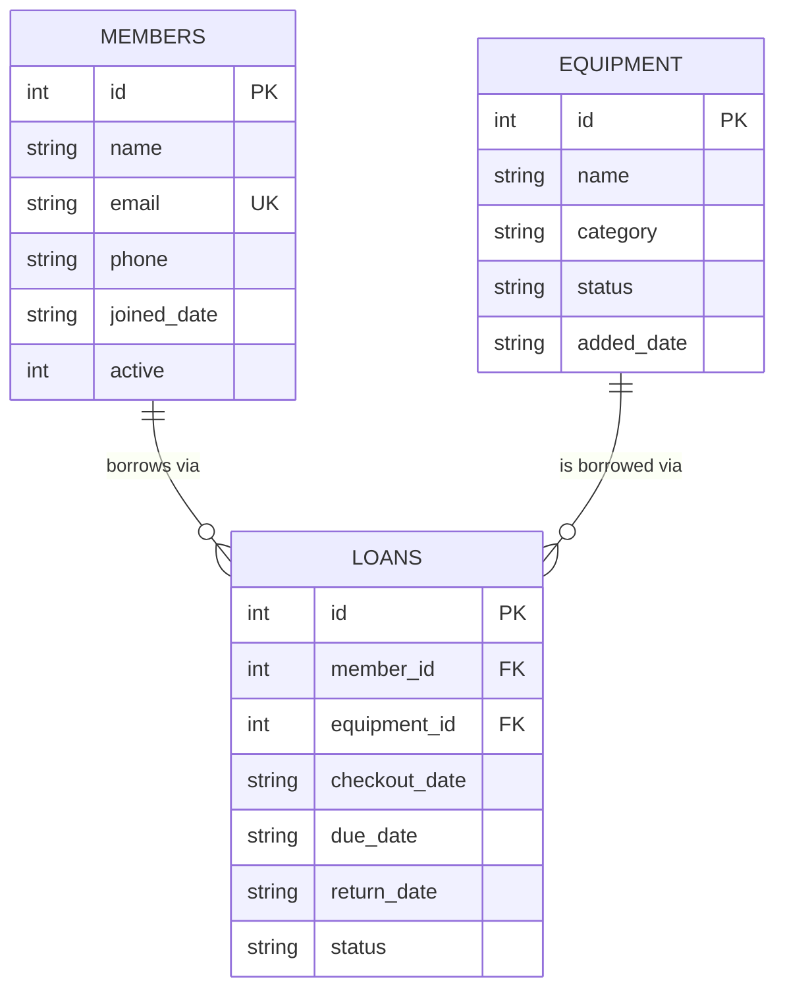

# Design Notes — Campus MakerSpace Checkout System

## 1. Entity-relationship overview

A `Loan` is the join entity between `Member` and `Equipment`: each loan
row references exactly one member and one piece of equipment, and a
member/equipment pair can have many loans over time (loan history).

## 2. Class responsibilities

| Class | Owns | Key behaviour |
|---|---|---|
| `Member` (models.py) | id, name, email, phone, joined_date, active | `is_active()`, `deactivate()`, `reactivate()` |
| `Equipment` (models.py) | id, name, category, status, added_date | `is_available()`, `mark_borrowed()`, `mark_available()`, `mark_maintenance()`, `mark_retired()` |
| `Loan` (models.py) | id, member_id, equipment_id, dates, status | `is_overdue()`, `close()` |
| `Database` (database.py) | sqlite3 connection | schema creation, `execute`/`fetchone`/`fetchall` |
| `MakerSpaceService` (services.py) | a `Database` instance | all CRUD + business rules; the only class that combines models with SQL |

`main.py` never touches SQL or the raw sqlite3 connection — it only calls
methods on `MakerSpaceService`, which is what keeps the menu loop thin and
readable, and why the OOP design and the database access are cleanly
separated (models describe *what things are*, `Database` describes *how
we talk to SQLite*, `MakerSpaceService` describes *what the app does*).

## 3. Key design decisions

- **Soft deletes.** Members are "deleted" by setting `active = 0` and
  equipment by setting `status = 'retired'`, rather than removing rows.
  This satisfies the brief's "Delete (or equivalent status updates)"
  requirement while keeping loan history intact and avoiding orphaned
  foreign keys.
- **Validation lives in the service layer**, not in `main.py` or the
  database. `main.py` only collects raw strings from `input()`;
  `MakerSpaceService` is responsible for rejecting bad data (empty
  names, malformed emails, duplicate emails, invalid status values) by
  raising a `ValidationError`. This means the same validation rules
  would automatically apply if a future GUI or web front-end called the
  same service class.
- **Custom exceptions (`errors.py`)** — `ValidationError`, `NotFoundError`,
  and `ConflictError` all inherit from `MakerSpaceError`, so `main.py`
  can catch one common exception type and always show a clean message
  instead of crashing.
- **Equipment availability is derived from a single `status` column**
  (`available` / `borrowed` / `maintenance` / `retired`) rather than a
  separate boolean, so it can represent more real-world states (e.g. an
  item can be temporarily under maintenance without being "on loan").
- **Reports are plain SQL, exposed as service methods** so they're easy
  to demo and explain live: `report_currently_borrowed`,
  `report_overdue_loans`, `report_equipment_by_category`, and
  `report_member_history` each map to one JOIN/GROUP BY query.

## 4. Things to check before your live demo

- Be ready to explain why `create_loan` checks the member and equipment
  *before* touching the database (fail fast, no partial writes).
- Be ready to walk through one SQL JOIN (e.g. `report_currently_borrowed`)
  line by line.
- Know why `members`/`equipment` use soft deletes instead of `DELETE FROM`.
- Try triggering a couple of validation errors live (e.g. borrowing
  already-borrowed equipment) to show the error handling in action.
